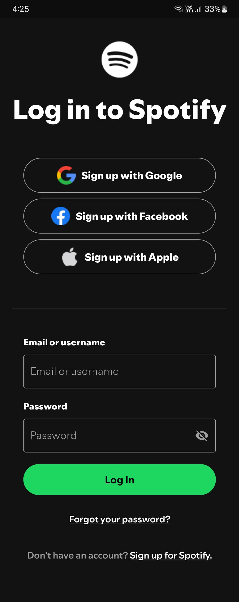
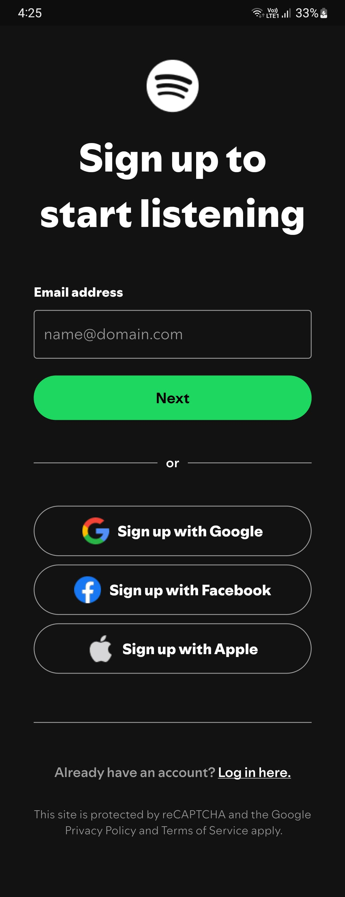

# Spotify Login Signup UI in Flutter

### Mobile Application Development Course - 5th Semester BSCS
### Class Assignment

1. Used Spotify official icons, font family, and color palette.
2. Setup mobile splash screen.
3. Used Stateful Widgets and list.generate function.

 

 

